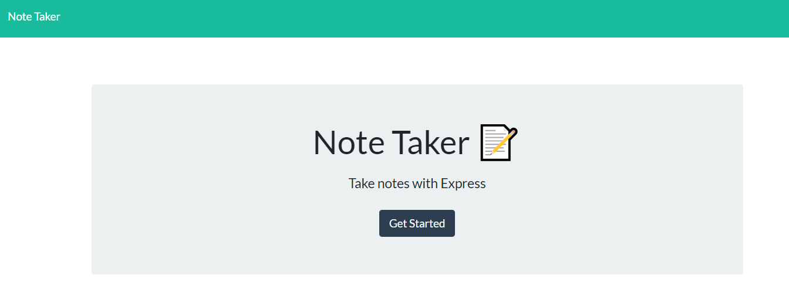

# Note Taker - Express.js
  
  

  ## Description
  The Note Taker application give the user the ability to add notes that will be saved in a json file. With the ability to save the notes the user can click on the note and read it later plus the application has the ability to delete a note if no longer needed.

  ## Table of Contents
  * [Installation](#installation)
  * [Usage](#usage)
  * [License](#license)
  * [Contributing](#contributing)
  * [Tests](#tests)
  * [Questions](#questions)
  
  ## Installation
  1. Copy the clone link of the repository from GitHub 
  2. Open Bash or Terminal Window 
  3. Navigate to the directory that the repo will reside 
  4. Type 'git clone' in the console and paste the repo link 
  5. Open the repo in code editor 
  6. Open terminal within code editor 
  7. Type 'npm install' to install dependency packes needed

  *Required packages:*
  *express

  ## Usage
  1. The user will navigate to https://note-taker-jam.herokuapp.com/
  2. Select the 'Get Started' button
  3. Type a note and hit the save icon

  ## Screen Shots:

  

  

  ## License
  This project is license under MIT

  ## Contributing
  Follow install instructions

  ## Tests
  npm test

  ## Questions
  If you have any questions about this project, please contact me directly at jasonamoore@frontier.com. You can view more of my projects at https://github.com/jamoore4579.
  